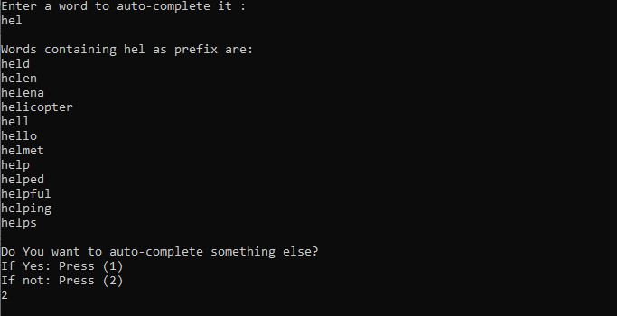
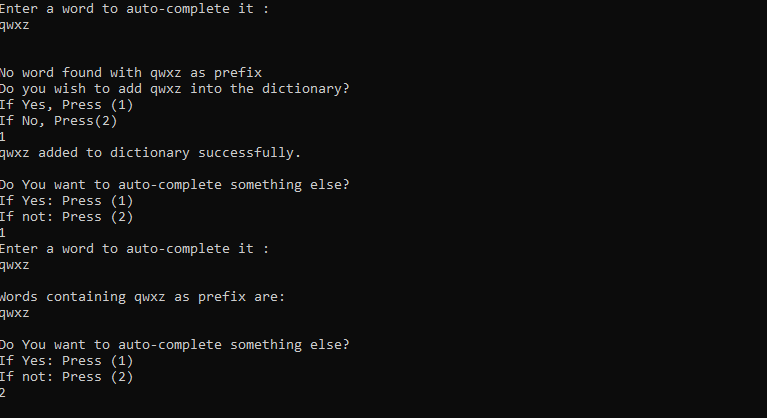

# Auto-Complete
Program to auto-complete the words in c++ using trie data-structure.

## Introduction

This project aims to auto-complete the input word with the help of a dictionary text file.
### Trie-Construction

1. First construct a trie of all words present in dictionary file.

### Auto-Complete

1. Get the word as input.
2. If the word is present as a prefix of atleast one word, function outputs all those words having prefix as given word.
Here is an example

3. If no word can be found having prefix as input word, then user has option to either add this word to dictionary or not.
Here is an example, we can see "qwxz" was firstly not present in the dictionary, but after user chooses to add, it got added to the dictionary.

